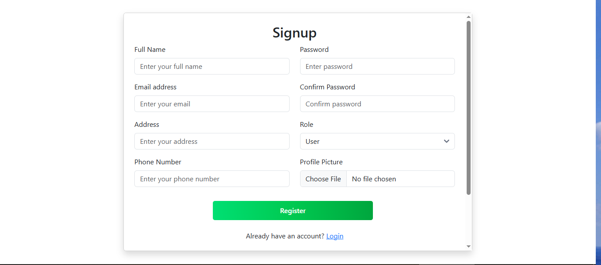

# SpiceHub - 2nd Semester Final Project

## Project Description
SpiceHub is a platform designed to manage and facilitate the buying and selling of spices. It includes features such as user management, bidding, payment processing, and profile management. The project is built using Spring Boot for the backend and a modern frontend framework for the user interface.

---

## Features
- User registration and login.
- Admin and user roles.
- Category management for spices.
- Spice management (CRUD operations).
- Email verification for user registration.
- Password reset functionality.
- Search functionality for spices.
- Sorting and filtering options for spices.
- Responsive design for mobile and desktop.
- User-friendly interface.
- User authentication and authorization.
- Bidding system for spices.
- Payment integration with PayHere and Stripe.
- Profile management for users and admins.
- Admin dashboard for managing users, categories, and payments.

---

## Screenshots
###  User Home Page


###  Admin  Home Page


### Add Category Page


### Login Page


### Manage Category Page


### Manage Spice Page


## My Bids Page


### Payment Page


### Admin Payments Page


### Profile Management Page


### Signup Page


### Update Category Page


### Update Spice Page


### Users Manage Page

---

## Setup Instructions

### Prerequisites
- Java 17
- Node.js and npm
- MySQL database
- Maven

### Backend Setup
1. Clone the repository:
   ```bash
   git clone https://github.com/your-repo/spicehub.git
   cd spicehub/backend
2. Install dependencies:
   ```bash
   mvn install
   ```
3. Configure the database connection in `src/main/resources/application.properties`:
   ```properties
    spring.datasource.url=jdbc:mysql://localhost:3306/spicehub
    spring.datasource.username=root
    spring.datasource.password=yourpassword
    spring.jpa.hibernate.ddl-auto=update
    spring.jpa.show-sql=true
    spring.jpa.properties.hibernate.dialect=org.hibernate.dialect.MySQL8Dialect
    spring.mail.host=smtp.gmail.com
    spring.mail.port=587
   ```
4. Run the application:
   ```bash
    mvn spring-boot:run
    ```
5. Access the backend API at `http://localhost:8080/api`.
6. Create the database `spicehub` in MySQL.
7. Run the SQL scripts in `src/main/resources/sql` to set up the initial database schema and data.
8.Build and run the application:
   ```bash
   mvn clean install
   mvn spring-boot:run
   ```
9. Access the application at `http://localhost:8080`.
10. Test the API endpoints using Postman or any other API testing tool.
11. Use the provided Postman collection to test the API endpoints.


### Frontend Setup
1. Navigate to the frontend directory:
   ```bash
   cd spicehub/frontend
   ```
   
### Technologies Used
- Java 17
- Spring Boot
- Spring Security
- Spring Data JPA
- MySQL
- Thymeleaf
- HTML/CSS
- JavaScript
- Bootstrap
- jQuery
- Maven
- Postman
- Lombok
- ModelMapper
- MapStruct
- JUnit
- Mockito
- Spring Test
- Spring Boot Test
- Spring Web
- Spring Mail
- Spring Boot DevTools
- Spring Boot Starter Validation
- Spring Boot Starter Thymeleaf
- Spring Boot Starter Data JPA
- Spring Boot Starter Security
- Spring Boot Starter Web
- Spring Boot Starter Test
- Spring Boot Starter Mail
- Spring Boot Starter Actuator
- Spring Boot Starter AOP
- Spring Boot Starter Cache
- Spring Boot Starter Data REST
- Spring Boot Starter HATEOAS
- Spring Boot Starter WebFlux


### Youtube Link 
https://youtu.be/tsTQSkIViJM?si=gurc4t6GX5oGprYj
   